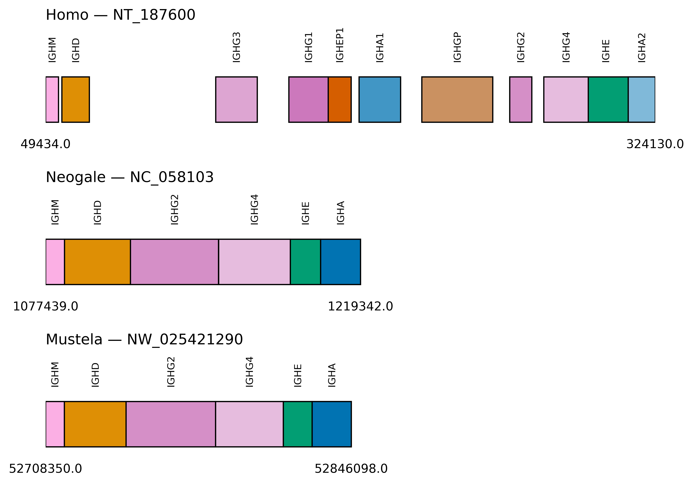

# Rationale
This repository records the steps taken & tools used to generate a map of the immunoglobulin C (constant) gene loci among multiple species. I used it to compare ferret IGHG genes specifically to related carnivores and to humans, as ferrets appear to only have two IGHG genes whereas humans have four. However, this code can be generalized for any species' genome assembly in which either IMGT C-GENE annotations exist or a determined researcher has their own proposed C-GENE genomic sequences to visualize.

Fortunately, IMGT provides C gene sequences for all these species. Unfortunately, their sequence record descriptions include start & stop positions that cannot trivially be mapped back to an organism's genome. Therefore, some other mapping tool must be employed to re-annotate their location within a genome. This repository uses a BLAST wrapper.

### Example map:

# Steps to Generate Interspecies C-Gene Map
## I. Acquire IMGT C genes & Genomes
### A. Use NCBI Datasets tool to download genome FASTAs: https://www.ncbi.nlm.nih.gov/datasets/docs/v2/reference-docs/command-line/datasets/
- Mustel putorius furo (domestic ferret)
    - `datasets download genome accession GCF_011764305.1 --include genome`
    - (assembly details: https://www.ncbi.nlm.nih.gov/datasets/genome/GCF_011764305.1/)
- Canis lupus familiaris (dog)
    - `datasets download genome accession GCF_000002285.5 --include genome`
    - (assembly details: https://www.ncbi.nlm.nih.gov/datasets/genome/GCF_000002285.5/)
- Homo sapiens (human)
    - `datasets download genome accession GCF_000001405.40 --include genome`
    - (assembly details: https://www.ncbi.nlm.nih.gov/datasets/genome/GCF_000001405.40/
- Neogale vison (mink)
    - `datasets download genome accession GCF_020171115.1 --include genome`
    - (assembly details: https://www.ncbi.nlm.nih.gov/datasets/genome/GCF_020171115.1/)
### B. Use IMGT's gene DB download tool to get previously-annotated entire genomic C gene sequences
- https://www.imgt.org/genedb/
- after narrowing selection by species, gene type C genes, immunoglobulin heavy chain, etc., select nucleotide FASTA output, "C-GENE" download option to get the full genomic C gene locus incuding exons & introns
- For dog IGHG1, IGHG3, and IGHG4, the "C-GENE" is not downloadable via IMGT. It appears these three genes have not been mapped within the immunoglobulin locus in the dog genome assembly, and instead their exons actually map best to a curated mRNA database. Therefore, I have used IGHG2's top 4 hits, hoping to catch the three IGHG paralogs in the dog genome assembly. See the '--dog' option in the besthits_perquery.py.

## II. Run scripts in this order to create C gene exon map
### A. Per Species
1. Run `keep_one_allele.py` on the IMGT C-GENE sequences FASTA
2. Download [makeblastdb](https://ftp.ncbi.nlm.nih.gov/blast/executables/blast+/LATEST/) or use [conda install](https://anaconda.org/bioconda/blast) and run `makeblastdb -in species_genome.fasta -parse_seqids -dbtype nucl`
3. Query the IMGT C-GENE sequences against their respective genome (formatted as a BLAST database in the previous step) by running `cgenes_BLASTn_genome.py`
4. Keep only the top BLAST hit for each query by running `besthits_perquery.py` (for dog, use the `--dog` flag; this returns the top *four* hits from the IGHG2 query because IGHG2 is the only annotated gamma gene in their genome assembly for some reason)
### B. Now using all Species Data
5. Combine the filtered BLASTn hits from all species with a command like `cat allhits_ferret_best.tsv <(tail -n +2 allhits_dog_best.tsv) <(tail -n +2 allhits_human_best.tsv) <(tail -n +2 allhits_mink_best.tsv) > allhits_allspecies_best.tsv`
6. Generate the interspecies IGHC gene map by running `cgene_map.py` on the filtered, combined hits.